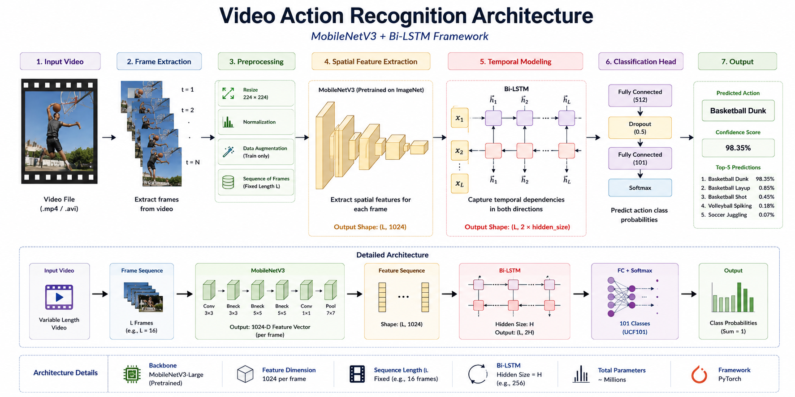
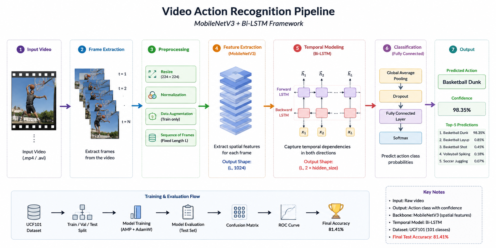
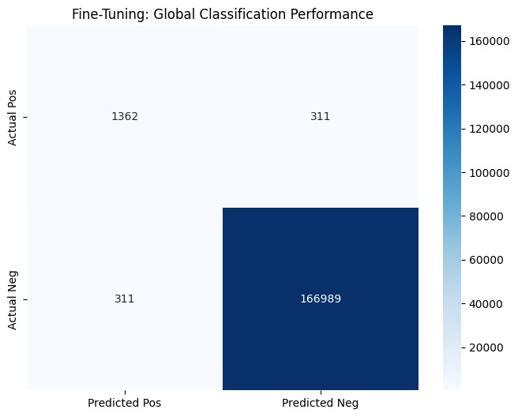
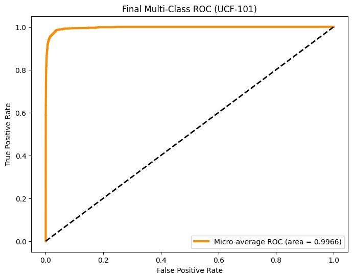

# 🎥 Video Action Recognition using MobileNetV3 + Bi-LSTM

<p align="center">


</p>

A deep learning framework for **human action recognition in videos** using **MobileNetV3** for spatial feature extraction and **Bi-LSTM** for temporal sequence modeling. The model is trained on the **UCF101** benchmark dataset and achieved an overall **81.41% classification accuracy**. This repository includes data preprocessing, model training, evaluation, and inference implemented with PyTorch.



---

# ✨ Features

- Human Action Recognition from videos
- MobileNetV3 feature extractor
- Bi-LSTM temporal modeling
- Mixed Precision Training (AMP)
- Automatic frame preprocessing
- End-to-end PyTorch implementation
- GPU acceleration using CUDA
- Confusion Matrix evaluation
- ROC Curve visualization
- Custom video inference

---

# 🧠 Model Architecture

```
Input Video
      │
      ▼
Frame Extraction
      │
      ▼
Frame Preprocessing
      │
      ▼
MobileNetV3
(Spatial Feature Extraction)
      │
      ▼
Feature Sequence
      │
      ▼
Bi-LSTM
(Temporal Modeling)
      │
      ▼
Fully Connected Layer
      │
      ▼
Softmax
      │
      ▼
Predicted Action
```

---

# 🏗️ Project Pipeline

<p align="center">

</p>

---

# 📂 Repository Structure

```text
Video-Action-Recognition-MobileNetV3-BiLSTM/

│
├── assets/
│   ├── Architecture.png
│   ├── Pipeline.png
│
├── docs/
│   ├── DATASET.md
│   ├── INSTALLATION.md
│
├── notebooks/
│   ├── Video_Action_Recognition.ipynb
│
├── outputs/
│   ├── Confusion-Matrix.jpeg
│   ├── ROC-Curve.jpeg
│
├── LICENSE
├── README.md
└── requirements.txt
```

---

# 📊 Dataset

The project uses the **UCF101 Human Action Recognition Dataset**, a benchmark dataset containing **13,320 videos** across **101 action categories**. It covers a diverse range of sports, daily activities, and human interactions, making it one of the most widely used datasets for action recognition research.

For dataset preparation and preprocessing instructions, refer to:

📄 **docs/DATASET.md**

---

# ⚙️ Installation

Clone the repository

```bash
git clone https://github.com/yourusername/Video-Action-Recognition-MobileNetV3-BiLSTM.git

cd Video-Action-Recognition-MobileNetV3-BiLSTM
```

Install dependencies

```bash
pip install -r requirements.txt
```

Detailed setup instructions are available in:

📄 **docs/INSTALLATION.md** 

---

# 🚀 Running the Project

Open the notebook

```
notebooks/Video_Action_Recognition.ipynb
```

The notebook includes:

- Dataset preprocessing
- Frame extraction
- Data loading
- Model construction
- Training
- Evaluation
- Prediction
- Model saving

---

# 📈 Model Performance

The proposed MobileNetV3 + Bi-LSTM architecture was evaluated on the **UCF101** benchmark dataset.

| Metric | Value |
|---------|------:|
| Dataset | UCF101 |
| Backbone | MobileNetV3 |
| Sequence Model | Bi-LSTM |
| Framework | PyTorch |
| Test Accuracy | **81.41%** |
| Evaluation | Confusion Matrix, ROC Curve |

---

# 📊 Evaluation Results

## Confusion Matrix

<p align="center">

</p>

The confusion matrix provides a detailed visualization of the model's classification performance across all action classes, highlighting correctly classified samples and common misclassifications.

---

## ROC Curve

<p align="center">

</p>

The Receiver Operating Characteristic (ROC) Curve illustrates the classifier's ability to distinguish between action classes across different decision thresholds.

---

# 💻 Technologies Used

- Python
- PyTorch
- TorchVision
- OpenCV
- NumPy
- Matplotlib
- Scikit-learn
- Pillow
- tqdm

---

# 🚀 Future Improvements

- Vision Transformer (ViT)
- TimeSFormer
- SlowFast Networks
- EfficientNet backbone
- Real-time webcam inference
- ONNX/TensorRT deployment
- Streamlit web application

---

# 📜 License

This project is licensed under the MIT License.

---

# 👨‍💻 Author

**Nauman Ahmed**

AI Engineer | Computer Vision | Deep Learning | Generative AI

If you found this repository helpful, consider giving it a ⭐ to support the project.
